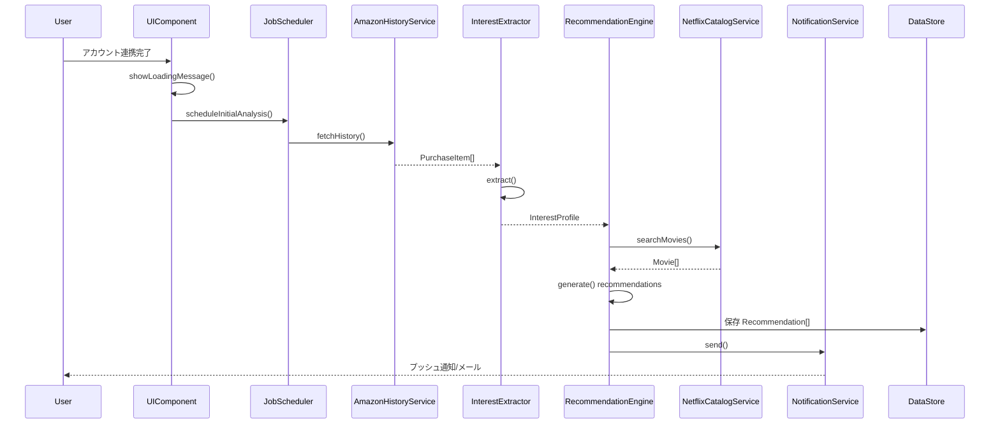
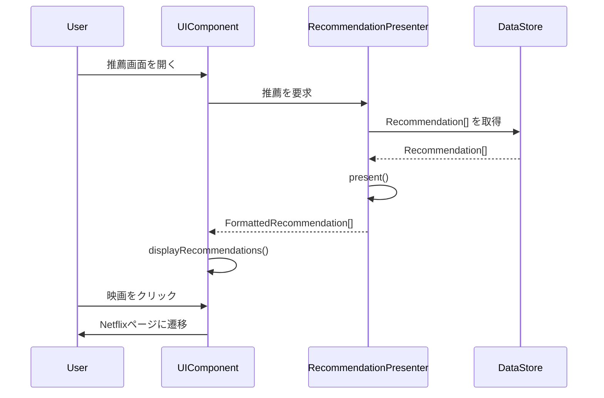

# ユニット2: 推薦生成と表示のためのコンポーネントモデル設計計画

この計画は、`aidlc-docs/design-artifacts/unit_2_recommendation_engine.md`に記載されているユーザーストーリーを実装するためのコンポーネントモデルを設計するためのステップを概説しています。

## 計画ステップ

- [x] **ステップ1: コアコンポーネントの特定と責務の定義**
    *   ユーザーストーリーに基づき、主要な論理コンポーネント（例: Amazon履歴アナライザー、Netflix推薦エンジン、推薦表示UI、通知サービス）を特定します。
    *   各コンポーネントの主要な責務と役割を定義します。

- [x] **ステップ2: コンポーネント間のデータフローとデータモデルの確立**
    *   各コンポーネントが処理または保持する主要な属性（データ）をリストアップします。
    *   コンポーネント間でデータがどのように流れるか（入力、出力）をマッピングします。
    *   必要に応じて、データモデル（例: 購入履歴アイテム、推薦映画オブジェクト）の初期ドラフトを作成します。
    *   外部API（Amazon API、NetflixカタログAPI）とのデータ交換フォーマットを考慮します。

- [x] **ステップ3: コンポーネントの振る舞い（メソッド/機能）の定義**
    *   各コンポーネントが実行する主要な振る舞い、メソッド、または機能をリストアップします。
    *   これらの振る舞いがユーザーストーリーの要件をどのように満たすかを関連付けます。

- [x] **ステップ4: コンポーネント相互作用の設計と可視化**
    *   各ユーザーストーリーを達成するために、コンポーネントがどのように連携して相互作用するかを記述します。
    *   シーケンス図や高レベルのアーキテクチャ図を用いて、相互作用の流れを可視化します。（設計フェーズで実施）

- [x] **ステップ5: エラー処理とエッジケースの検討（高レベル）**
    *   API呼び出しの失敗、データが利用できない場合（例: 購入履歴がない）、ネットワークの問題など、潜在的なエラーシナリオを検討します。
    *   初回ユーザーのオンボーディングと推薦の初期生成のプロセスを考慮します。

- [x] **ステップ6: 永続化要件の特定**
    *   システムが永続的に保存する必要があるデータ（例: ユーザー設定、Amazonトークン、生成された推薦リスト、分析済みの興味プロファイル）を特定します。
    *   データの保存場所（データベース、キャッシュなど）について高レベルで検討します。

- [x] **ステップ7: ユーザーによるレビューと承認の取得**
    *   上記の計画が完了したら、ユーザーにレビューを求め、承認を得ます。承認後、次のステップに進みます。

---

この計画は、コンポーネントモデルの設計に必要なすべての側面をカバーしているはずです。計画の各ステップが完了したら、このファイルの対応するチェックボックスを更新します。

---

## コンポーネントモデル

### ステップ1: コアコンポーネントと責務

1.  **`AmazonHistoryService`**
    *   **責務:** ユーザーのAmazonアカウントと連携し、購入履歴データを安全に取得する。（ユーザーストーリー2.1）
    *   Amazon APIまたは他のデータ取得メカニズムとの通信をカプセル化する。

2.  **`InterestExtractor`**
    *   **責務:** `AmazonHistoryService`から提供された購入履歴を分析し、ユーザーの興味（ジャンル、キーワード、俳優、監督など）を抽出・プロファイル化する。（ユーザーストーリー2.1）
    *   商品名やカテゴリから映画関連の情報を推測するロジックを持つ。

3.  **`NetflixCatalogService`**
    *   **責務:** Netflixの映画カタログ（または相当するデータソース）を検索する機能を提供する。（ユーザーストーリー2.2）
    *   キーワードやジャンルに基づいて映画情報を取得するインターフェースを提供する。

4.  **`RecommendationEngine`**
    *   **責務:** `InterestExtractor`によって特定されたユーザーの興味と、`NetflixCatalogService`から得られる映画情報を使用して、推薦リストを生成する。（ユーザーストーリー2.2）
    *   各推薦に対して関連度スコアを計算し、リストをランク付けする。
    *   視聴済み映画の除外ロジック（もし可能なら）を含む。

5.  **`RecommendationPresenter`**
    *   **責務:** `RecommendationEngine`によって生成された推薦データを、UIで表示するための形式に整形する。（ユーザーストーリー2.3）
    *   推薦理由（どの購入履歴に基づいているかなど）を生成する。
    *   ポスター画像、あらすじ、ジャンルなどの表示用データを準備する。

6.  **`UIComponent`**
    *   **責務:** 整形された推薦リストをユーザーに表示する。（ユーザーストーリー2.3）
    *   無限スクロール、映画詳細へのナビゲーション（Netflixへのディープリンク）、待機状態の表示（「推薦を準備中です...」）などのUIロジックを実装する。

7.  **`NotificationService`**
    *   **責務:** 初回の推薦リストが生成されたときなど、特定のイベントが発生した際にユーザーに通知（プッシュ通知やメール）を送信する。（ユーザーストーリー2.4）

8.  **`JobScheduler`**
    *   **責務:** 時間のかかるタスクや定期的なタスクを管理・実行する。（ユーザーストーリー2.1, 2.2, 2.4）
    *   初回の購入履歴分析や、週ごとの推薦更新などをバックグラウンドで実行するようスケジュールする。

---

### ステップ2: データモデルとデータフロー

#### データモデル (Data Models)

1.  **`PurchaseItem`** - Amazonでの単一の購入アイテムを表す
    *   `id`: `string` - 商品の一意なID
    *   `name`: `string` - 商品名
    *   `category`: `string` - 商品カテゴリ
    *   `purchaseDate`: `Date` - 購入日

2.  **`InterestProfile`** - ユーザーの興味プロファイル
    *   `userId`: `string` - ユーザーID
    *   `keywords`: `string[]` - 抽出されたキーワード (例: "SF", "ミステリー", "トム・ハンクス")
    *   `genres`: `string[]` - 抽出されたジャンル (例: "アクション", "ドキュメンタリー")
    *   `sourceItems`: `PurchaseItem[]` - 興味の元となった購入アイテム

3.  **`Movie`** - Netflixカタログの映画情報
    *   `id`: `string` - 映画の一意なID
    *   `title`: `string` - タイトル
    *   `genres`: `string[]` - ジャンル
    *   `summary`: `string` - あらすじ
    *   `posterUrl`: `string` - ポスター画像のURL
    *   `netflixUrl`: `string` - Netflix上の映画へのリンク

4.  **`Recommendation`** - 単一の推薦映画
    *   `movie`: `Movie` - 推薦する映画オブジェクト
    *   `score`: `number` - 推薦の関連度スコア
    *   `reason`: `string` - なぜこの映画が推薦されたかの説明 (例: 「『デューン 砂の惑星』の購入履歴に基づいています」)

#### データフロー (Data Flow)

1.  **`AmazonHistoryService` -> `InterestExtractor`**
    *   **データ:** `PurchaseItem[]` (ユーザーの購入履歴リスト)
    *   **トリガー:** `JobScheduler`によるスケジュール実行、またはユーザーの初回連携時。

2.  **`InterestExtractor` -> `RecommendationEngine`**
    *   **データ:** `InterestProfile` (分析されたユーザーの興味プロファイル)
    *   **トリガー:** `InterestExtractor`での分析完了後。

3.  **`NetflixCatalogService` -> `RecommendationEngine`**
    *   **データ:** `Movie[]` (興味プロファイルのキーワードやジャンルに基づいて検索された映画のリスト)
    *   **トリガー:** `RecommendationEngine`が必要に応じて映画情報をリクエスト。

4.  **`RecommendationEngine` -> (データ永続化層)**
    *   **データ:** `Recommendation[]` (生成された推薦リスト)
    *   **トリガー:** 推薦リストの生成/更新完了後、後で表示するために保存。

5.  **(データ永続化層) -> `RecommendationPresenter`**
    *   **データ:** `Recommendation[]` (保存された推薦リスト)
    *   **トリガー:** ユーザーが推薦画面を開いたとき。

6.  **`RecommendationPresenter` -> `UIComponent`**
    *   **データ:** 表示用に整形された`Recommendation`オブジェクトのリスト (ポスター画像URL、タイトル、推薦理由など)
    *   **トリガー:** `RecommendationPresenter`がデータ整形を完了した後。

7.  **`RecommendationEngine` -> `NotificationService`**
    *   **データ:** 通知ペイロード (例: { `userId`, `message`: "新しい推薦の準備ができました！" })
    *   **トリガー:** 初回の推薦生成が完了したとき。

---

### ステップ3: コンポーネントの振る舞い（メソッド/機能）

1.  **`AmazonHistoryService`**
    *   `fetchHistory(userId: string, period: Timespan): Promise<PurchaseItem[]>`
        *   指定された期間のユーザーの購入履歴を取得します。（ユーザーストーリー 2.1）

2.  **`InterestExtractor`**
    *   `extract(items: PurchaseItem[]): InterestProfile`
        *   購入履歴アイテムのリストを分析し、キーワードとジャンルを抽出して興味プロファイルを返します。（ユーザーストーリー 2.1）

3.  **`NetflixCatalogService`**
    *   `searchMovies(query: string, type: 'keyword' | 'genre'): Promise<Movie[]>`
        *   キーワードまたはジャンルに基づいてNetflixカタログを検索し、映画のリストを返します。（ユーザーストーリー 2.2）

4.  **`RecommendationEngine`**
    *   `generate(profile: InterestProfile): Promise<Recommendation[]>`
        *   興味プロファイルに基づいて、スコアリングとランク付けされた推薦リストを生成します。（ユーザーストーリー 2.2）

5.  **`RecommendationPresenter`**
    *   `present(recommendations: Recommendation[]): FormattedRecommendation[]`
        *   推薦リストをUI表示に適した形式に変換します。（ユーザーストーリー 2.3）

6.  **`UIComponent`**
    *   `displayRecommendations(formattedRecs: FormattedRecommendation[])`
        *   整形済みの推薦リストを画面にレンダリングします。（ユーザーストーリー 2.3）
    *   `showLoadingMessage()`
        *   推薦の準備中に待機メッセージを表示します。（ユーザーストーリー 2.4）
    *   `handleMovieClick(netflixUrl: string)`
        *   映画がクリックされたときにNetflixのページに遷移します。（ユーザーストーリー 2.3）

7.  **`NotificationService`**
    *   `send(userId: string, message: string): Promise<void>`
        *   ユーザーに通知を送信します。（ユーザーストーリー 2.4）

8.  **`JobScheduler`**
    *   `scheduleInitialAnalysis(userId: string)`
        *   ユーザーの初回連携時に購入履歴の分析ジョブをスケジュールします。（ユーザーストーリー 2.4）
    *   `schedulePeriodicUpdate(userId: string, interval: Duration)`
        *   推薦リストの定期的な更新ジョブをスケジュールします。（ユーザーストーリー 2.2）

---

### ステップ4: コンポーネント相互作用

#### ユーザーストーリー2.1 & 2.2 & 2.4: 初回推薦生成フロー

このフローは、ユーザーがアカウントを連携した直後に実行されます。

1.  **ユーザー**がアカウント連携を完了します。
2.  **UIComponent**が `showLoadingMessage()` を呼び出し、「推薦を準備中です...」というメッセージを表示します。
3.  同時に、**JobScheduler**が `scheduleInitialAnalysis()` を呼び出して、バックグラウンドでの推薦生成プロセスを開始します。
4.  **JobScheduler**がトリガーとなり、**AmazonHistoryService**の `fetchHistory()` を呼び出します。
5.  **AmazonHistoryService**が購入履歴 (`PurchaseItem[]`) を取得し、**InterestExtractor**に渡します。
6.  **InterestExtractor**が `extract()` を実行し、興味プロファイル (`InterestProfile`) を生成して**RecommendationEngine**に渡します。
7.  **RecommendationEngine**が `generate()` を開始し、興味プロファイルに基づいて**NetflixCatalogService**に `searchMovies()` を複数回呼び出して映画情報を収集します。
8.  **RecommendationEngine**が推薦リスト (`Recommendation[]`) を生成し、スコアリングとランク付けを行い、結果を**データ永続化層**に保存します。
9.  **RecommendationEngine**が**NotificationService**に `send()` を依頼し、ユーザーに推薦が完了したことを通知します。

#### ユーザーストーリー2.3: 推薦リストの表示フロー

1.  **ユーザー**が推薦表示画面を開きます。
2.  **UIComponent**が**RecommendationPresenter**に推薦リストを要求します。
3.  **RecommendationPresenter**が**データ永続化層**から最新の推薦リスト (`Recommendation[]`) を取得します。
4.  **RecommendationPresenter**が `present()` を実行し、各推薦に理由を追加したり、UIに適した形式にデータを整形します。
5.  **RecommendationPresenter**が整形済みのデータ (`FormattedRecommendation[]`) を**UIComponent**に返します。
6.  **UIComponent**が `displayRecommendations()` を呼び出し、リストを画面に表示します。ユーザーがスクロールすると、必要に応じて次のデータを要求します（無限スクロール）。
7.  **ユーザー**が特定の映画をクリックすると、**UIComponent**が `handleMovieClick()` を呼び出し、対応するNetflixページに遷移させます。

---

### ステップ5: エラー処理とエッジケース

-   **シナリオ1: Amazon購入履歴が取得できない**
    -   **原因:** APIエラー、認証切れ、ネットワーク問題。
    -   **振る舞い:**
        -   `AmazonHistoryService` はエラーを返し、`JobScheduler` がリトライ処理を行う（例: 指数バックオフで数回試行）。
        -   リトライがすべて失敗した場合、プロセスは中止され、`UIComponent` にエラー状態が通知される。
        -   `UIComponent` は、「購入履歴の取得に失敗しました。時間をおいて再度お試しください」などのメッセージを表示する。

-   **シナリオ2: 購入履歴が存在しない、または映画関連のアイテムがない**
    -   **原因:** ユーザーがAmazonで買い物をしたことがない、または関連性のない商品しか購入していない。
    -   **振る舞い:**
        -   `InterestExtractor` が空の `InterestProfile` を返す。
        -   `RecommendationEngine` は推薦を生成できず、`UIComponent` にその状態を通知する。
        -   `UIComponent` は、「推薦の生成に必要な情報が不足しています。Amazonでの書籍やDVDの購入履歴があると、より精度の高い推薦が可能です」といった案内を表示する。

-   **シナリオ3: Netflixカタログで映画が見つからない**
    -   **原因:** 抽出されたキーワードがニッチすぎる、またはNetflix APIの一時的な問題。
    -   **振る舞い:**
        -   `RecommendationEngine` は空の推薦リストを生成する。
        -   `UIComponent` は、「ご興味に合う映画が見つかりませんでした。時間とともに改善されますので、しばらくお待ちください」といったメッセージを表示する。

-   **シナリオ4: 初回推薦生成が非常に長い時間がかかる**
    -   **原因:** 大量の購入履歴、外部APIの遅延。
    -   **振る舞い:**
        -   `UIComponent` は `showLoadingMessage()` で待機中であることを明確に伝え、推定待機時間を表示する（例：「最大で10分ほどかかります」）。
        -   バックグラウンド処理が完了したら、`NotificationService` を通じてユーザーに通知し、アプリを再度開くよう促す。

---

### ステップ6: 永続化要件

-   **1. Usersテーブル (データベース)**
    -   **データ:** `userId`, `amazonAuthToken`, `netflixAuthToken` (もし必要なら), `notificationPreferences`
    -   **目的:** ユーザーアカウント情報と外部サービス連携のための認証情報を安全に保管する。

-   **2. InterestProfilesテーブル (データベース)**
    -   **データ:** `userId`, `InterestProfile` オブジェクト (またはそのシリアライズされた形式)
    -   **目的:** 分析されたユーザーの興味プロファイルを保存し、再分析なしで推薦を再生成できるようにする。

-   **3. Recommendationsテーブル (データベース)**
    -   **データ:** `userId`, `Recommendation[]` (生成された推薦リスト)
    -   **目的:** 最新の推薦リストを保存し、ユーザーがアプリを開いた際に高速に表示できるようにする。

-   **4. JobStatusテーブル (データベース or Key-Valueストア)**
    -   **データ:** `jobId`, `userId`, `status` (pending, in_progress, completed, failed), `lastUpdatedAt`
    -   **目的:** バックグラウンドジョブの状態を追跡し、失敗したジョブのリトライや状態監視に使用する。

-   **5. MovieCache (キャッシュ - 例: Redis, Memcached)**
    -   **データ:** `movieId` をキーとした `Movie` オブジェクト
    -   **目的:** `NetflixCatalogService` から取得した映画の情報をキャッシュし、外部APIへのコール数を削減してパフォーマンスを向上させる。
